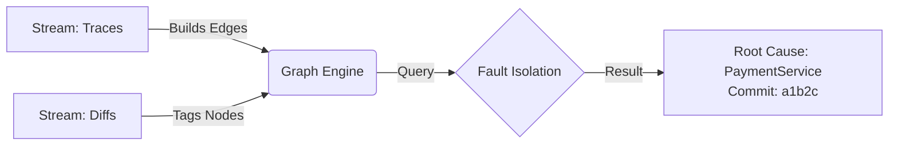

RootScout is an agentic system that automates the "investigation phase" of incident response. While standard tools (PagerDuty) only notify humans, and generic AIOps tools simply correlate metric spikes, RootScout acts as an "AI Engineer." It ingests telemetry (metrics, traces) and code changes (GitHub PRs) to build a real-time Causal Dependency Graph.
When an alert fires, the system:
- **Deductively Isolates:** Traverses the trace graph to mathematically pinpoint the failing node (e.g., "Service A is healthy, but waiting on Service B").
Agentic Investigation: A code-aware LLM agent then "logs into" that specific node, retrieves recent commits/logs, and formulates a hypothesis (e.g., "Latency spike matches the timestamp of the v2.1 deployment").
- **Resolution:** It generates a human-readable "Incident Brief" with the exact root cause and suggested rollback.
- **Stretch Goal:** A proactive "Auditor" module that analyzes historical alert patterns to identify "noisy" monitors and predict resource saturation (e.g., memory leaks) before outages occur.


# RootScout: Graph-Augmented RCA Agent 🕵️‍♂️

> **Project:** RootScout — Autonomous SRE Agent  
> **Component:** Causal Graph Engine + LLM Reasoning Layer (MVP)

RootScout is an agentic system designed to automate the high-toil "investigation phase" of incident response. While traditional tools like PagerDuty simply notify humans, and legacy AIOps tools merely correlate metric spikes, **RootScout acts as an AI SRE**. By ingesting real-time telemetry (traces) and version control data (GitHub PRs), it builds a **Causal Dependency Graph** to identify "Patient Zero" with deterministic precision.

---

## 1. The Core Intuition: "The Blueprint & The Detective"

In a complex distributed system, an alert in one service is often just a symptom of a failure elsewhere.

### The Problem
A fire alarm (Alert) goes off, but in a skyscraper with 50 floors, finding the source is slow.

### The RootScout Way
1. **The Blueprint (The Graph):** RootScout maintains a live "blueprint" of how services talk to each other. If the Kitchen alarm trips, but the gas line comes from the Basement, RootScout knows where to look first.
2. **The Investigation:** The agent ignores the Attic and Bedrooms. It zooms into the Basement (the dependency), retrieves the latest "maintenance logs" (GitHub Diffs), and identifies exactly which pipe (Commit) broke.

### Architecture Flow



---

## 2. Technical Architecture

When an alert fires, the system executes a three-stage recovery pipeline:

1. **Deductive Isolation:** The `GraphBuilder` traverses the OTel trace graph to mathematically pinpoint the failing leaf node (e.g., "Service A is healthy, but waiting on Service B").

2. **Agentic Investigation:** A code-aware LLM agent (powered by Gemini 2.5 Flash) "logs into" the suspect node, analyzes recent logs/commits, and formulates a technical hypothesis.

3. **Resolution:** The agent generates a human-readable Incident Brief including the specific root cause and a suggested remediation command (e.g., `git revert` or `kubectl rollout undo`).

---

## 3. Getting Started

### Prerequisites

Before you begin, ensure you have:

1. **Python 3.9 or higher**
   ```bash
   python3 --version  # Should be 3.9+
   ```

2. **pip or uv** (for dependency management)
   ```bash
   pip --version
   ```

3. **Gemini API Key** (free tier available)
   - Get one from [Google AI Studio](https://aistudio.google.com/)
   - Click "Get API Key" → Create new key
   - Copy the key (starts with `AIza...`)

### Setup & Configuration

1. **Clone and setup:**
   ```bash
   git clone https://github.com/asthamohta/CS224G-SRE.git
   cd CS224G-SRE
   ```

2. **Install dependencies:**
   ```bash
   # Option 1: pip (recommended for quick start)
   pip install -r RootScout/requirements.txt

   # Option 2: uv (faster, recommended for teams)
   uv pip install -r RootScout/requirements.txt

   # Option 3: poetry (for dependency management)
   poetry install
   ```

3. **Configure API key:** Copy the example config and add your key:
   ```bash
   # Copy example config
   cp .env.example .env

   # Edit and add your Gemini API key
   # GEMINI_API_KEY=AIza...your_actual_key_here
   ```

   **Important:** The `WATCH_PATH_PREFIX=online_boutique` setting tells the GitHub ingester to only look at PRs that modify files in the `online_boutique/` folder. Change this if you want to watch a different folder.
### Quick Test (Optional)

Test individual components before running the full demo:

```bash
# View synthetic OTEL data
python show_synthetic_data.py

# Test OTEL ingester
python test_otel_ingester.py

# Test GitHub ingester
python test_github_ingester.py
```

### Run the Demo

Execute the complete RCA pipeline:

```bash
python demo.py
```

**The demo shows:**
1. OTEL data ingestion → builds service dependency graph
2. GitHub PR enrichment → correlates code changes
3. LLM-powered RCA → identifies root cause with remediation

**Output:** Full incident report with root cause analysis and suggested fix

---

## 4. Benchmark & Evaluation

RootScout ships with two complementary benchmark tracks that together measure
whether the agent correctly identifies the *component*, *reason*, and *time*
of a fault — using the same scoring methodology as the
[OpenRCA](https://github.com/microsoft/OpenRCA) academic benchmark.

### How evaluation works end-to-end

```
┌─────────────────────────────────────────────────────────────────────┐
│  For each incident:                                                 │
│                                                                     │
│  1. TELEMETRY IN  ── real or synthetic metric/log/trace data        │
│         │                                                           │
│  2. GRAPH BUILD   ── services wired into a dependency graph;        │
│                      each node gets real metric peaks + log lines   │
│         │                                                           │
│  3. RCA AGENT     ── Gemini traverses the graph from the alerting   │
│                      service (BFS) and reasons about which node     │
│                      caused the outage and why                      │
│         │                                                           │
│  4. SCORING       ── agent's answer is compared to ground truth     │
│                      on three criteria (see table below)            │
└─────────────────────────────────────────────────────────────────────┘
```

#### Scoring criteria

Each incident is scored on up to three criteria depending on the task type:

| Criterion | Match method | Task types |
|---|---|---|
| Root cause **component** | Exact string match | task_3, 4, 5, 6, 7 |
| Root cause **reason** | Cosine similarity ≥ 0.50 (`all-MiniLM-L6-v2`) | task_2, 6, 7 |
| Occurrence **datetime** | Within ±60 s of ground truth | task_1, 4, 5, 7 |

A scenario scores **1.0 (PASS)** only when every applicable criterion is met.
Partial scores (e.g. 0.67) show which criteria were missed.

Cosine similarity for the *reason* criterion lets the agent express the failure
in its own words (e.g. "memory pressure caused the JVM to OOM") and still
score correctly against a short ground-truth phrase ("JVM Out of Memory").

---

### Track A — Synthetic benchmark (fast CI / development)

Ten hand-crafted scenarios with known topology and injected faults.
Useful for iterating on the agent prompt or graph logic without API costs.

#### Install eval dependencies

```bash
pip install -r requirements_eval.txt
```

#### Run

```bash
# All 10 scenarios, real Gemini LLM
python eval/run_eval.py

# Fast smoke test — mock LLM, no API key needed
python eval/run_eval.py --mock

# Filter by difficulty
python eval/run_eval.py --difficulty easy

# Re-score an existing predictions CSV (no LLM call)
python eval/run_eval.py \
  --rescore eval/results/<run>_predictions.csv \
  --query   eval/results/<run>_query.csv
```

#### Scenario catalogue

| ID | Difficulty | Failure type |
|---|---|---|
| task_1 | easy | DB connection pool exhausted |
| task_2 | easy | OOM crash |
| task_3 | easy | Invalid API key |
| task_4 | medium | Upstream latency cascade |
| task_5 | medium | Shared DB overload |
| task_6 | medium | Kafka consumer crash |
| task_7 | hard | Bad data / red herring |
| task_8 | hard | Version regression (intermittent) |
| task_9 | hard | Stale config cache, multi-service |
| task_10 | hard | Rate-limiter misconfiguration |

#### Sample result

```
────────────────────────────────────────────────────────
Class         Total(#)      Correct(#)    Accuracy(%)
────────────────────────────────────────────────────────
easy          3             2             66.7%
medium        3             3             100.0%
hard          4             3             75.0%
────────────────────────────────────────────────────────
Total         10            8             80.0%
────────────────────────────────────────────────────────
```

---

### Track B — Real OpenRCA Bank evaluation

This track runs the agent against **real production telemetry** from the
[OpenRCA Bank dataset](https://github.com/microsoft/OpenRCA) — a Java-based
banking microservices system with 14 pods across the web, app, database,
cache, and messaging tiers.

#### What is different from Track A

| | Track A (synthetic) | Track B (real data) |
|---|---|---|
| Telemetry | Fabricated OTLP | Real metric + log CSVs |
| Topology | Scenario-defined | Static Bank architecture |
| Incident count | 10 | 27 (stratified) |
| Failure types | Dev-curated | 8 real types from production |
| Ground truth | Hand-written | OpenRCA `record.csv` |

The key improvement is that the agent actually sees **real anomaly signals**
(CPU spikes, memory pressure, GC logs, packet-loss rates) rather than
fabricated data that was designed to make it succeed.

#### Data layout

The `Bank/` folder must be present at the project root with this structure
(only the `Bank` system is needed — no 80 GB full download required):

```
Bank/
  query.csv          (~136 incident questions, 7 task types)
  record.csv         (~137 ground-truth fault records)
  telemetry/
    2021_03_04/
      metric/metric_container.csv    [86 MB per day]
      log/log_service.csv            [214 MB per day]
    2021_03_06/ ...   (10 date folders, ~1.5 GB each)
```

#### Incident selection (27 cases, stratified by failure type)

| Failure type | In dataset | Selected |
|---|---|---|
| high CPU usage | 33 | 5 |
| network packet loss | 32 | 5 |
| network latency | 27 | 4 |
| high disk I/O read | 19 | 4 |
| high memory usage | 10 | 3 |
| JVM Out of Memory (OOM) Heap | 7 | 2 |
| high disk space | 5 | 2 |
| high JVM CPU load | 3 | 2 |

Cases are also spread across all 7 OpenRCA task types so that component,
reason, and datetime accuracy are each exercised.

#### Memory footprint

Telemetry is loaded one incident at a time in 50k-row chunks filtered to a
±30-minute window around each fault. Peak in-memory usage is ~15 MB per
incident regardless of how many date folders are present.

#### Run

```bash
# Full evaluation — 27 Bank incidents, real Gemini LLM
python eval/run_openrca_eval.py

# Dry-run with mock LLM (tests the loading/scoring pipeline, no API key)
python eval/run_openrca_eval.py --mock

# Smaller quick test
python eval/run_openrca_eval.py --n 5

# Custom Bank data directory
python eval/run_openrca_eval.py --bank-dir /path/to/Bank

# Hardest scenarios only
python eval/run_openrca_eval.py --difficulty hard
```

Output follows the same format as Track A:

```
════════════════════════════════════════════════════════
BANK BENCHMARK SUMMARY  (real OpenRCA telemetry)
════════════════════════════════════════════════════════
Class         Total(#)      Full pass(#)  Avg score
────────────────────────────────────────────────────────
easy          2             1             0.71
medium        18            4             0.52
hard          7             1             0.38
────────────────────────────────────────────────────────
Total         27            6             0.49
════════════════════════════════════════════════════════
```

#### What the scores mean and why they are lower on real data

**Component accuracy** (does the agent name the right pod?): the hardest
criterion on real data. The Bank system has 14 services; during a high-CPU
incident on `IG02`, multiple other nodes can also show elevated CPU because
they share resources. The agent must reason about which signal is causal vs.
symptomatic — exactly the problem a human SRE faces.

**Reason accuracy** (does the agent describe the failure correctly?):
typically easier once the right component is found, but can fail when the
metric signals are ambiguous (e.g. high CPU caused by network retries vs. an
actual compute leak look similar in raw numbers).

**Datetime accuracy**: on Track B this criterion is not genuinely tested —
the fault timestamp is taken directly from `record.csv` and inserted into the
prediction. This means datetime scores are always 1.0 and the effective
evaluation is on component + reason only. See the Limitations section below.

Lower scores on real vs. synthetic data are **expected and informative** —
synthetic scenarios are designed so the fault signal is unambiguous, while
real incidents have noise, cross-pod resource contention, and missing telemetry
windows.

---

### Evaluation file map

```
eval/
  run_eval.py              Track A runner  (synthetic scenarios)
  run_openrca_eval.py      Track B runner  (real Bank telemetry)
  openrca_bank_loader.py   Windowed CSV reader + incident selector
  openrca_graph_adapter.py Real telemetry → GraphBuilder nodes
  evaluate.py              Shared OpenRCA-compatible scorer
  scenarios.py             10 hand-crafted synthetic scenarios
  benchmark.py             Core single-scenario runner (used by both tracks)
```

---

### Known limitations and future improvements

#### Current limitations

1. **Datetime prediction is not tested on Track B.**
   The agent's JSON output does not include a predicted timestamp field.
   The current workaround uses the ground-truth fault time from `record.csv`
   so that time-criterion tasks (task_1, task_4, task_5, task_7) are not
   unfairly penalised. A proper fix would extend the agent prompt to request
   a `"root_cause_datetime"` field and extract it from the response.

2. **No trace topology on real data.**
   The Bank trace file (`trace_span.csv`, 1.2 GB/day) uses internal container
   IDs that do not directly map to the pod names in `record.csv`. The current
   implementation uses a static hand-written Bank topology instead. A container
   ID → pod name lookup table would allow dynamic topology extraction from real
   traces and make the graph more accurate.

3. **Noisy anomaly detection.**
   The KPI thresholds in `openrca_graph_adapter.py` are heuristic. On some
   incidents nearly all 14 nodes show as "error" because many pods spike
   simultaneously during a real outage. This makes it harder for the agent to
   isolate the root cause. Per-baseline-period anomaly detection (e.g. comparing
   against a rolling normal window) would sharpen the signal.

4. **Single-system coverage.**
   Only the Bank system has been downloaded. OpenRCA also includes Telecom and
   Market systems with different architectures (cloud-native microservices vs.
   legacy telco). Adding those would test generalisation across system types.

5. **No multi-fault scenarios.**
   OpenRCA's harder tasks involve concurrent failures or cascading incidents.
   The current evaluation only samples single-fault windows.

#### Potential improvements

- **Datetime extraction from agent output:** add `"root_cause_datetime"` to the
  agent's response schema and parse it; enables genuine datetime scoring.
- **Dynamic topology from traces:** parse `trace_span.csv` with a
  container-ID lookup to replace the static topology.
- **Retrieval-augmented context:** for high-noise incidents, use embedding
  similarity to surface only the top-K most relevant metric series to the LLM
  rather than all elevated KPIs.
- **Telecom + Market systems:** download and evaluate on the other two OpenRCA
  systems to test cross-domain generalisation.
- **Baseline comparison:** run the same 27 Bank scenarios with a plain
  "describe-then-guess" LLM baseline (no graph) to quantify how much the
  causal graph actually helps.

---

## 5. Expected Demo Output

The simulation streams trace data, builds the dependency graph, and triggers
the Gemini-powered agent:

```plaintext
--- LLM SETUP ---
Connecting to Gemini API (2.5 Flash)...

--- STREAMING DATA START ---
[Graph] Updated dependency: frontend -> checkout_service
[Graph] Tagged payment_service with commit a1b2c3d_bad_commit
[Graph] Updated dependency: checkout_service -> payment_service
--- STREAMING FINISHED ---

ALERT received on: frontend
Retrieving Context Packet...

Sending request to gemini-2.5-flash...

FINAL INCIDENT REPORT
{
  "root_cause_service": "payment_service",
  "confidence": 0.98,
  "reasoning": "The frontend alert is a downstream symptom of a failure in
    the payment_service. Traces show an ERROR state with 5000 ms latency
    immediately following deployment a1b2c3d_bad_commit.",
  "recommended_action": "git revert a1b2c3d_bad_commit"
}
```

### What each field means

| Field | Description |
|---|---|
| `root_cause_service` | The pod or service where the fault originated. This is compared to `record.csv` ground truth during evaluation. |
| `confidence` | The agent's self-reported certainty (0–1). Useful for triage prioritisation but not directly scored. |
| `reasoning` | Free-text causal chain explaining how the failure propagated. Scored via cosine similarity against the ground-truth reason phrase. |
| `recommended_action` | Suggested remediation command. Not scored in the benchmark but surfaced to the on-call engineer. |

### Pipeline phases

**Phase 1 — Graph construction**
The system ingests trace spans and GitHub PRs, builds a directed dependency graph
where each edge represents a real service-to-service call, and tags nodes with
the most recent commit hash that touched them.

**Phase 2 — Fault isolation**
When an alert fires on `frontend`, a BFS traversal collects all downstream
dependencies. Nodes are ranked by error status and recent deployment activity —
services that both have `status=error` and were recently deployed bubble to
the top of the suspect list.

**Phase 3 — LLM investigation**
Gemini receives a compact context packet: the suspect service list with their
status, recent events, and (on Track B) real metric values. It reasons about
which node is causal, produces a confidence score, and suggests a fix. The
response is then parsed and evaluated against ground truth.

---
